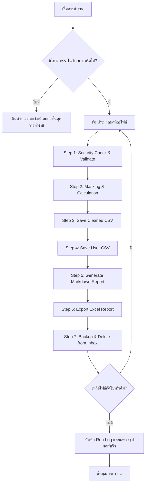

# คู่มือและอธิบายการทำงานของระบบ Copier Report Processor (Secure Edition)

ระบบนี้พัฒนาขึ้นเพื่อประมวลผลไฟล์รายงานการใช้งานเครื่องถ่ายเอกสารดิบ (Raw CSV) จากนั้นทำการวิเคราะห์ คำนวณค่าใช้จ่ายตามอัตราบริการ ตลอดจนปกป้องข้อมูลส่วนบุคคล (PDPA) ด้วยการ Masking ข้อมูลอ่อนไหว ก่อนจะส่งออกรายงานรูปแบบต่างๆ ได้แก่ Cleaned CSV, Processed User CSV, Markdown และ Excel

---

## 1. โครงสร้างโฟลเดอร์และการจัดเก็บไฟล์ (Folder Structure)

ระบบทำงานบนโครงสร้างโฟลเดอร์ที่เป็นระบบระเบียบเพื่อแยกสถานะของไฟล์ข้อมูลอย่างชัดเจน:

| โฟลเดอร์ | หน้าที่และรายละเอียด |
| :--- | :--- |
| **`00_Inbox/`** | **โฟลเดอร์รับเข้า:** วางไฟล์รายงานเครื่องถ่ายเอกสารต้นฉบับที่เป็นรูปแบบ `.csv` (ชื่อไฟล์ใดๆ ก็ได้) ที่นี่เพื่อรอประมวลผล |
| **`01_Raw_Report/`** | **สำเนาต้นฉบับ (Read-only):** ระบบจะคัดลอกไฟล์จาก Inbox มาเก็บไว้ที่นี่ทันทีเพื่อการตรวจสอบย้อนกลับ (Audit Trail) โดยจะถูกจำกัดสิทธิ์ให้เขียนไม่ได้ (Read-only) |
| **`02_Cleaned_Report/`** | **ไฟล์ข้อมูลที่ทำความสะอาดแล้ว:** ไฟล์ CSV ที่ผ่านการทำความสะอาด ลบช่องว่าง ค่าว่าง และ Mask ข้อมูลเรียบร้อยแล้ว โดยใช้รูปแบบชื่อเดิมตามด้วย `_cleaned.csv` |
| **`03_Processed_Output/`** | **ผลลัพธ์การประมวลผลเพื่อนำไปใช้ต่อ:** ประกอบด้วยไฟล์ `user_usage_report.csv` (ตารางสรุปแบบ Masked) และไฟล์ `copier_summary_report.md` (รายงานสรุปสรุปค่าบริการแบบ Markdown) |
| **`04_Excel_Report/`** | **รายงาน Excel เพื่อการนำเสนอ:** เก็บไฟล์ `.xlsx` (ชื่อไฟล์เดิมตามด้วย `_Report.xlsx`) ซึ่งจัดแต่งสีสันและฟอนต์สวยงาม (ใช้ TH Sarabun New) มีหน้าสรุปและหน้ารายละเอียดรายบุคคล |
| **`05_Log/`** | **ประวัติการทำงาน:** เก็บไฟล์ Log การทำงานของระบบในรูปของ Text file แยกตามเวลาที่รัน (`run_log_YYYYMMDD_HHMMSS.txt`) สำหรับใช้วิเคราะห์เมื่อเกิดปัญหา |
| **`06_Backup/`** | **โฟลเดอร์สำรองข้อมูลย้อนหลัง:** เมื่อรันเสร็จแล้ว ไฟล์ต้นฉบับใน Inbox จะถูก Backup มาเก็บไว้ที่นี่แยกตามโฟลเดอร์ Timestamp (`06_Backup/YYYYMMDD_HHMMSS/`) และตั้งเป็น Read-only ก่อนจะลบออกจาก Inbox เพื่อเตรียมรอบถัดไป |
| **`Markdown/`** | **รายงานสรุปประเภท Markdown:** รวบรวมเอกสารวิเคราะห์และรายงานสรุปผลลัพธ์ในฟอร์แมต Markdown (เช่น `copier_summary_report.md`, `copier_report_analysis.md`, และ `user_usage_report.md`) |
| **`scripts/`** | **โฟลเดอร์เก็บโค้ดทดสอบย่อย:** ประกอบด้วยสคริปต์เดี่ยวๆ ที่ใช้ในการวิเคราะห์ข้อมูล (เช่น `analyze_report.py`, `export_excel.py`, `generate_user_report.py`) ก่อนที่จะรวบรวมฟังก์ชันการทำงานทั้งหมดเป็นระบบความปลอดภัยสูง (Secure Edition) ในไฟล์หลัก |

---

## 2. ขั้นตอนการประมวลผลข้อมูล (Data Processing Workflow)

การประมวลผลใน `run_report.py` มีขั้นตอนการทำงาน (Pipeline) ที่เป็นลำดับขั้นตอนดังนี้:



### รายละเอียดในแต่ละขั้นตอน (Step-by-step Detail)

1. **Step 1 : Security Check + Validation**
   - ตรวจสอบนามสกุลไฟล์ต้นทาง ต้องเป็น `.csv` เท่านั้น **[SC-1]**
   - ตรวจสอบว่าไฟล์ตั้งอยู่ในโฟลเดอร์ `00_Inbox` เท่านั้นเพื่อป้องกันการดึงไฟล์ภายนอกระบบมาทำงาน **[SC-2]**
   - สำเนาไฟล์ดิบไปที่ `01_Raw_Report` และเซ็ต Permission ให้เป็น **Read-only** เพื่อป้องกันการแก้ไขในภายหลัง **[SC-5]**
   - ตรวจสอบคอลัมน์ในตาราง (Headers) ต้องมีคอลัมน์สำคัญครบถ้วน ได้แก่:
     * `User` และ `Name`
     * `Black & WhiteTotal(Printer)` และ `ColorTotal(Printer)`
     * `Black & WhiteTotal(Copier/Document Server)` และ `Full ColorTotal(Copier/Document Server)`
     * `ScannerTotal(Scanner)`
   - หากคอลัมน์ไม่ครบถ้วน ระบบจะบันทึกข้อความผิดพลาดลงใน Log และข้ามไฟล์นั้นทันที

2. **Step 2 : Masking & Calculation**
   - อ่านข้อมูลผู้ใช้ในตารางแบบบรรทัดต่อบรรทัด
   - คลีนค่าว่างหรือสัญลักษณ์แปลกปลอม เช่น `[ ]`, `"`, `'`, ช่องว่าง หรือเครื่องหมาย `-` ให้เป็นค่าปกติ (ตัวเลข 0 หรือ String ปกติ)
   - ทำการ **Masking ข้อมูลส่วนบุคคล (User ID และ Name)** ทันที เพื่อความปลอดภัย **[SC-3]** ตัวอย่าง:
     * รหัสพนักงาน `6804` $\rightarrow$ `6**4`
     * ชื่อ `SUKANYA` $\rightarrow$ `S*****A`
   - คำนวณจำนวนการใช้งานและคิดค่าบริการแยกตามประเภท โดยอ้างอิงจากตารางราคา (Rate Table)
   - คัดแยกเฉพาะผู้ใช้ที่มีการใช้งานจริง (การใช้งานรวม > 0) เพื่อนำไปสรุปข้อมูล

3. **Step 3 : บันทึก Cleaned CSV**
   - บันทึกตารางข้อมูลที่ทำความสะอาดและ Mask แล้ว ลงในโฟลเดอร์ `02_Cleaned_Report/` โดยระบบมีกลไกตรวจสอบว่าจะต้องไม่มีการเขียนทับไฟล์ดิบใน Inbox **[SC-4]**

4. **Step 4 : บันทึก User Usage CSV**
   - ส่งออกข้อมูลการใช้บริการรายบุคคลที่ Mask แล้วไปยัง `03_Processed_Output/user_usage_report.csv`

5. **Step 5 : บันทึก Markdown Report**
   - สร้างรายงานผลวิเคราะห์สรุปยอดรวมและรายบุคคลในฟอร์แมต Markdown บันทึกลงใน `03_Processed_Output/copier_summary_report.md` (และเก็บในโฟลเดอร์ `Markdown/`)

6. **Step 6 : ส่งออกรายงาน Excel**
   - เขียนข้อมูลสรุปยอดการใช้งานและรายละเอียดรายบุคคลลงในไฟล์ Excel `.xlsx` แยกออกเป็น 2 ชีต:
     * **ชีต "สรุปรายงาน":** แสดงอัตราค่าบริการและยอดการใช้งานรวมพร้อมราคาสุทธิแยกตามสัดส่วน
     * **ชีต "รายละเอียดรายบุคคล":** แสดงตารางใช้งานและค่าใช้จ่ายของพนักงานที่ผ่านการ Mask แล้ว
   - จัดแต่งสีสันให้อ่านง่าย มีตารางสลับสี (Alternating rows), ตรึงแนวหัวตาราง (Freeze panes) และใช้ฟอนต์ไทยมาตรฐาน (TH Sarabun New)

7. **Step 7 : Backup & Delete**
   - ย้ายไฟล์ต้นฉบับใน Inbox ไปไว้ใน `06_Backup/YYYYMMDD_HHMMSS/` พร้อมเปลี่ยนสถานะเป็น Read-only จากนั้นลบไฟล์เดิมออกจาก Inbox เพื่อไม่ให้ถูกประมวลผลซ้ำในการรันครั้งหน้า

---

## 3. มาตรการควบคุมความปลอดภัยของข้อมูล (Security Controls - SC)

เพื่อให้เป็นไปตามกฎหมายคุ้มครองข้อมูลส่วนบุคคล (PDPA) และลดความเสี่ยงที่เกิดจากการจัดการไฟล์โดยไม่พึงประสงค์ ระบบมีการควบคุมความปลอดภัยดังนี้:

* **`[SC-1] รับเฉพาะไฟล์ .csv`** — สแกนเฉพาะไฟล์ที่ลงท้ายด้วย `.csv` เท่านั้น ป้องกันการนำเข้าสคริปต์อันตรายหรือไฟล์ประเภทอื่น
* **`[SC-2] ตรวจสอบแหล่งที่มาของไฟล์`** — ตรวจสอบพาธ (Path) ของไฟล์ดิบ ต้องอยู่ภายใต้ `00_Inbox` เท่านั้น เพื่อจำกัดพื้นที่การเขียน/อ่านไฟล์ของโปรแกรม
* **`[SC-3] Mask User ID + Name ก่อนเข้า Workflow`** — ลบรหัสพนักงานและชื่อจริงจากในรายงานสรุปทั้งหมดทันที โดยแทนที่อักษรตรงกลางด้วยสัญลักษณ์ `*` คงไว้เฉพาะตัวแรกและตัวสุดท้าย
* **`[SC-4] ห้ามแก้ไขไฟล์ต้นฉบับ`** — ระบบจะไม่มีการเขียนไฟล์ผลลัพธ์ทับลงในพาธเดิมของไฟล์ดิบเพื่อความปลอดภัยของข้อมูลดิบดั้งเดิม
* **`[SC-5] สำเนาต้นฉบับเก็บในรูปแบบ Read-only`** — เมื่อรันงานระบบจะนำสำเนาไฟล์ต้นฉบับย้ายไปไว้ที่โฟลเดอร์ `01_Raw_Report` และเปลี่ยน Attribute เป็น Read-only ป้องกันผู้รันระบบแก้ไขข้อมูลย้อนหลัง

---

## 4. อัตราค่าบริการที่ใช้คำนวณ (Rate Table)

อัตราค่าบริการถูกกำหนดไว้ที่ส่วนหัวของสคริปต์หลัก (`run_report.py`) ในตัวแปร `RATE_TABLE` ซึ่งสามารถเข้ามาแก้ไขได้ตามต้องการ:

* **Print ขาวดำ (B&W):** 0.50 บาท / แผ่น
* **Print สี (Color):** 1.00 บาท / แผ่น
* **Copy ขาวดำ (B&W):** 0.50 บาท / แผ่น
* **Copy สี (Color):** 1.00 บาท / แผ่น
* **สแกนเอกสาร (Scanner):** ฟรี (0.00 บาท)

---

## 5. วิธีการใช้งานและการเปิดระบบ

1. **เตรียมไฟล์:** นำไฟล์รายงานเครื่องถ่ายเอกสารที่เป็นไฟล์ `.csv` (เช่น `RICOH IM C4510_usercounter.csv`) ไปวางไว้ในโฟลเดอร์ `00_Inbox`
2. **ติดตั้ง Dependency:** หากเป็นการใช้งานครั้งแรก สามารถคลิกดับเบิ้ลคลิกไฟล์ `install_dependencies.bat` เพื่อติดตั้งแพ็กเกจ Python ที่จำเป็น (เช่น `openpyxl` สำหรับสร้างไฟล์ Excel)
3. **รันระบบ:** รันไฟล์ Python หลักผ่าน Terminal ด้วยคำสั่ง:
   ```powershell
   python run_report.py
   ```
4. **ดูผลลัพธ์:** เข้าไปดูรายงานที่ประมวลผลแล้วเสร็จที่โฟลเดอร์:
   - **`04_Excel_Report/`** สำหรับไฟล์ Excel นำเสนอ
   - **`03_Processed_Output/`** และ **`Markdown/`** สำหรับไฟล์สรุป Markdown และตารางสรุปย่อย
   - **`05_Log/`** เพื่อตรวจสอบสถานะการประมวลผลและขั้นตอน Security Controls
